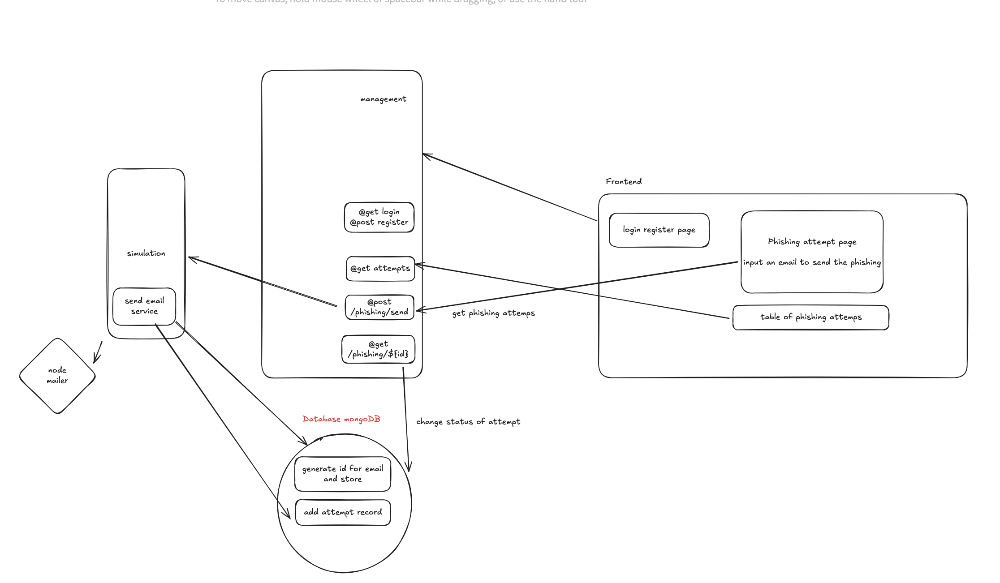

# Phishing Simulation and Management

This project simulates a basic architecture with NestJS-based microservices: **Simulation** microservice and **Management** app. These services communicate via TCP and are containerized using Docker including the UI app.


## Architecture Overview

**Please find attached how the architecture is organized.**




## Backend Overview

- **Simulation Microservice**:
    - Listens for requests from the Management service.
    - Send a phishing email via Nodemailer.

- **Management**:
    - Handles authorization and phishing attempts.
    - HTTP based server for the UI app.


## Prerequisites

Before running the application, ensure you have the following installed on your machine:

- [Docker](https://www.docker.com/get-started)
- [Docker Compose](https://docs.docker.com/compose/install/)

## Quick Start

To quickly spin up both microservices and get them running, follow these steps:

1. Clone this repository:
   ```bash
   git clone https://github.com/And151/phishing-simulation.git
   cd phishing-simulation-app

2. Run the application:
   ``` 
   docker-compose up --build

